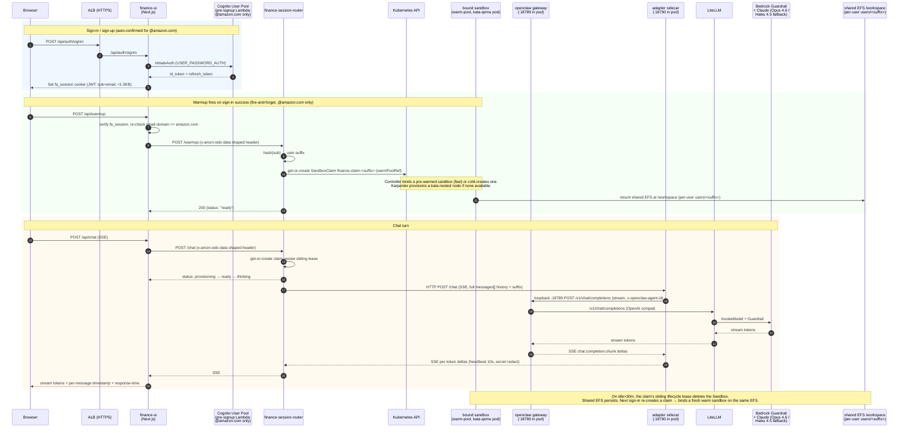

# Finance Assistant

Per-user AI financial reasoning assistant running in a Kata VM. Cognito direct-API auth for sign-in/sign-up (not ALB Cognito integration), Server-Sent Events for streaming chat, persistent EFS-backed `/workspace` so context survives across sessions.

## Flow



## Per-user lifecycle

1. **Sign-up (`@amazon.com` only)**: Cognito pre-signup Lambda rejects any other email domain and auto-confirms amazon addresses (no email code). UI then auto-signs the user in and redirects to `/chat`.
2. **Warmup on sign-in**: `AuthModal` fires `POST /api/warmup` fire-and-forget. The server-side route double-checks `email.endsWith("@amazon.com")` before calling the router. Router get-or-creates the user's `SandboxClaim`, waits for it to bind + Ready, returns 200. By the time the user types, the Kata pod is up.
3. **First request from user X**: router hashes `sub` claim into 10-hex `suffix`. Get-or-creates `SandboxClaim finance-claim-<suffix>` (`warmPoolRef: finance`); the agent-sandbox controller binds a pre-warmed sandbox from the pool (fast) or cold-creates one. Karpenter provisions a kata node if needed. The shared EFS volume mounts at `/workspace`; the adapter provisions the user's openclaw agent rooted at `/workspace/users/<suffix>` on first interaction. openclaw gateway boots, reads its rendered config, binds `:18789`.
4. **Subsequent requests**: router finds the bound sandbox via the claim, proxies the SSE stream directly, and renews the sliding idle lease on each message.
5. **Idle > 30 min**: the claim's sliding lifecycle lease (`shutdownPolicy: Delete`) deletes the Sandbox — no reaper CronJob. The shared EFS volume is untouched, so each user's `/workspace/users/<suffix>` files (`goals.md`, `decisions.md`, etc.) remain.
6. **User returns**: `/chat` page useEffect also fires a defensive warmup so the Sandbox rebuilds in the background before they type. All EFS content is still there.

## What's in /workspace

| File | Purpose |
|---|---|
| `goals.md` | User-stated financial goals, horizon, priorities |
| `snapshot.md` | Self-reported financial picture, dated |
| `scenarios/*.md` | Saved scenario models |
| `decisions.md` | Log of material decisions the user made |
| `questions.md` | Open items for a licensed pro |
| `sessions/*.jsonl` | openclaw chat history (cross-turn memory) |

Note: UI chat history (timestamps + response-time) is additionally persisted client-side in `localStorage` keyed on Cognito `sub` for fast page-load render; the server-side transcript on EFS is the source of truth.

## Customize the system prompt

Edit `gitops/usecases/finance-assistant/system-prompt-configmap.yaml`. It is written into the gateway's `openclaw.json` as `agents.defaults.systemPromptOverride` (not as a BOOT.md file — that caused the agent to greet each user with an identity-bootstrap preamble on every turn). `skipBootstrap: true` prevents openclaw from injecting its own workspace-bootstrap context. ArgoCD reconciles and the next pod boot reads the new prompt. Existing workspaces are preserved.

## Security posture

- Kata-qemu VM isolation (own kernel)
- Non-root, readOnlyRootFilesystem where possible, all caps dropped, seccomp RuntimeDefault
- NetworkPolicy: egress only to litellm:4000 and kube-dns:53
- Secrets via tmpfs projected volume, mode 0400 (no env vars → never show in `env`)
- Adapter redacts `sk-*`, `AKIA*`, JWTs, hashes, base64 blobs from every stream
- Bedrock Guardrail enforces PII anonymization + content filtering
- LiteLLM → Bedrock via Pod Identity (no IAM keys at rest)
- **Three fences against non-`@amazon.com` provisioning**: Cognito pre-signup Lambda, client-side check in `AuthModal.kickWarmup()`, server-side check in `/api/warmup` route.
- **Session cookie discipline**: `fa_session` JWT carries only `sub` + `email` (stays under 1.5KB) — never the Cognito `id_token`/`refresh_token` (blowing past Chromium's 4KB limit, cookie silently dropped).

## Troubleshooting

```bash
# see all user sandboxes
kubectl get sandbox -n finance-assistant

# router logs (routing decisions, creation events, warmup calls)
kubectl logs -n finance-assistant -l app=finance-session-router --tail=50

# a specific user's sandbox
kubectl logs -n finance-assistant finance-sandbox-<suffix> -c openclaw --tail=50
kubectl logs -n finance-assistant finance-sandbox-<suffix> -c adapter  --tail=50

# LiteLLM health
kubectl get pods -n litellm
kubectl logs -n litellm -l app.kubernetes.io/name=litellm --tail=30
```
