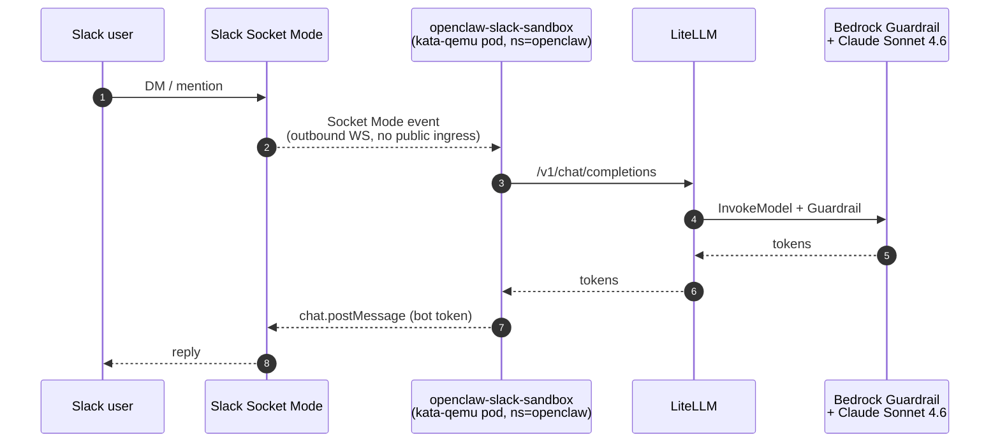

# Slack Usecase

openclaw agent exposed to Slack via Socket Mode. No public ingress. Outbound-only WebSocket from the sandbox to Slack's servers.

## Flow



## Prerequisites

1. Create a Slack App at https://api.slack.com/apps → "From scratch".
2. Enable **Socket Mode**. Generate an **App-Level token** with `connections:write` scope. This is `SLACK_APP_TOKEN` (starts with `xapp-`).
3. Under **OAuth & Permissions**, add bot scopes: `chat:write`, `im:history`, `im:read`, `im:write`, `app_mentions:read`. Install the app to your workspace and copy the **Bot User OAuth Token**. This is `SLACK_BOT_TOKEN` (starts with `xoxb-`).
4. Under **Event Subscriptions**, enable events and subscribe bot to `message.im`, `app_mention`.

## Deploy

Create the tokens secret:

```bash
kubectl create secret generic slack-tokens \
  --namespace openclaw \
  --from-literal=bot-token='xoxb-...' \
  --from-literal=app-token='xapp-...'
```

ArgoCD's `slack-sandbox` Application (wave 4) will then stamp the Sandbox.

## Verify

```bash
kubectl get sandbox -n openclaw
# finance-sandbox-slack   (Ready)

kubectl logs -n openclaw openclaw-slack-sandbox -c openclaw --tail=30
# [gateway] listening on 0.0.0.0:18789 ...
# [channels/slack] socket connected
```

DM the bot in Slack. Reply should return in 3–8 s (first token) and stream thereafter.

## Notes

- Tokens live only in the pod as tmpfs-mounted secrets; no env var exposure.
- Socket Mode means no public HTTP endpoint, no ALB. Lower attack surface than request URL events.
- `dmPolicy: open` allows anyone in the workspace to DM the bot. Tighten `allowFrom` in `gitops/usecases/slack/sandbox.yaml` if needed.
