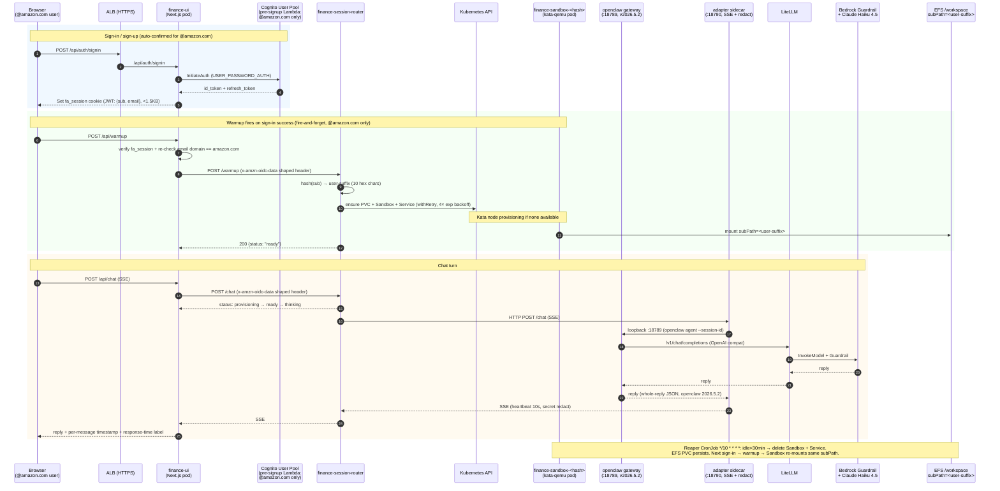

# Architecture & UI Recommendation

## UI recommendation: build the web UI

You asked whether Slack or a custom UI. For a personal financial assistant, **build the web UI**. Slack is the right call for `claw-bot` because claw-bot is a general coding/ops buddy that lives where you already work. A financial assistant is different:

| Requirement | Slack | Custom web UI |
|---|---|---|
| Chat | Good | Good |
| Render scenario charts (amortization, Monte Carlo) | Poor — static images only | Native — interactive recharts |
| Upload PDFs / statements | OK | Better — drag-drop, preview, redaction UI |
| Side-by-side scenario compare | No | Yes |
| Edit your `snapshot.md` as a form, not a chat turn | No | Yes |
| "Stunning" feel | No — it's Slack | Yes — you own the pixels |
| Privacy feel | Your data passes through Slack workspace | Stays in your AWS account |
| Mobile | Slack app | PWA works fine |

Slack's a messaging product. For a finance tool you want **artifacts**: charts that update as you drag a slider, a sidebar with your goals you can edit in place, a "decisions log" view. Slack can't do any of that cleanly.

Recommendation: **web UI as primary, Slack as a lightweight quick-question channel that shares the same PVC**. Most days you'll use the web UI. On mobile, you'll DM the Slack bot a one-liner and it'll answer from the same memory.

## High-level architecture

See [`generated-diagrams/openclaw-architecture.drawio`](../../generated-diagrams/openclaw-architecture.drawio) — page 2 "Finance Assistant Flow" — for the canonical diagram. The mermaid below matches what's actually shipping in production and renders inline on GitHub.



Three fences against non-`@amazon.com` provisioning:

1. **Cognito pre-signup Lambda** — rejects signup; auto-confirms amazon emails (no email-code loop)
2. **Client-side check** in `AuthModal.kickWarmup()` — won't fire the request
3. **Server-side check** in `/api/warmup` — 403 + log if domain mismatch (belt-and-suspenders for forged cookies)

Key properties:

- **Per-user sandbox**, one Kata QEMU VM per Cognito `sub`. Hash produces a 10-hex suffix used for PVC + Sandbox + Service name.
- **fa_session cookie** carries only `{sub, email}` — never the Cognito `id_token`/`refresh_token`. Keeps the cookie under 1.5KB so Chromium doesn't silently drop it (>4KB = dropped).
- **No outbound internet from the Kata VM** except the LiteLLM Service ClusterIP. NetworkPolicy enforces this.
- **openclaw pinned to 2026.5.2** (not `:latest`). 2026.4.29 re-ran full agent init per turn (~90s); 2026.5.2 is ~17s.
- **System prompt** injected via `agents.defaults.systemPromptOverride` in `openclaw.json`, not via BOOT.md. `skipBootstrap: true` prevents the agent from greeting every turn with "who am I?"
- **Chat history** survives across sessions in two layers:
  - Server-side (source of truth): openclaw's `sessions/*.jsonl` on the EFS PVC
  - Client-side (fast render): UI `localStorage` keyed on Cognito `sub`, last 200 messages with per-message timestamp + assistant response-time label
- **Bedrock Guardrail** overlay — denied topics for "specific stock picks," "guaranteed returns," "insider information"; PII filters for SSN, account numbers, routing numbers.

## Deployment waves (fits your existing ArgoCD app-of-apps)

```
Wave 3 (existing): openclaw operator + base Sandbox CRD
Wave 4 (new):      finance-assistant namespace, PVC, Sandbox, ConfigMaps
Wave 5 (new):      finance-ui Deployment + Service + Ingress
```

Drop two new Application manifests into `gitops/apps/` and ArgoCD picks them up.

## Web UI — what it looks like

A three-pane layout, keyboard-driven:

```
┌─────────────┬──────────────────────────────┬─────────────────────┐
│ Sidebar     │ Chat                         │ Artifact panel      │
│             │                              │                     │
│ Goals       │ you: if I put $2k/mo into... │ [interactive chart] │
│ Snapshot    │                              │                     │
│ Scenarios   │ agent: here's the projection │ Drag horizon slider │
│ Decisions   │ [inline chart preview]       │ Drag return slider  │
│ Questions   │                              │ See sensitivity     │
│             │ [/] scenario save            │                     │
│ /export     │ [/] scenario load "house"    │                     │
│ /redact     │                              │                     │
└─────────────┴──────────────────────────────┴─────────────────────┘
```

Stack:
- **Next.js 15 + App Router** — SSR for the chat shell, client components for charts.
- **Tailwind + shadcn/ui** — "stunning" comes free if you don't fight it.
- **Recharts** or **Visx** for financial charts.
- **Zustand** for client state.
- **Server-Sent Events** for streaming agent tokens; no websockets needed.
- **Upload flow**: browser → signed POST to UI pod → UI pod forwards to sandbox `/upload` → sandbox writes to `/workspace/inbox/<timestamp>/`. Document never leaves the cluster.

The UI pod is a thin proxy — it holds no chat state. All state lives on the Sandbox PVC. This matters: if the UI pod crashes or you redeploy it, nothing is lost.

## Security posture

- **Kata QEMU VM** — hardware isolation, own kernel. (Same as existing platform.)
- **NetworkPolicy** — egress allowed only to LiteLLM Service IP + DNS. No general internet.
- **Pod Identity** — the sandbox has *no AWS credentials*. Only LiteLLM has Bedrock access. Agent can't call AWS directly.
- **Cognito** — ALB authenticates before traffic reaches the UI pod. No anonymous access.
- **Encrypted PVC** — EBS gp3 with KMS encryption, key scoped to the namespace.
- **Guardrail** — denied topics + PII redaction on every model call.
- **LiteLLM budget** — hard monthly spend cap per virtual key.
- **No logging of chat content** — LiteLLM logs are metrics-only. Request/response bodies are not persisted. (Default config ships this way; verify your overrides.)

## Cost shape

Running cost, single user:

| Component | Rough monthly |
|---|---|
| Kata bare-metal node (shared with claw-bot) | $0 incremental if node already running |
| PVC (5 GB gp3) | ~$0.50 |
| LiteLLM pod (shared) | $0 incremental |
| Bedrock calls (Claude Sonnet 4.6, ~50 conversations/mo) | $5–20 depending on depth |
| ALB | ~$20 (shared with other apps drops this) |
| Cognito | Free tier for <50k MAU |

Call it $25–40/mo incremental on an already-running cluster. If you tear the cluster down between uses, the bare-metal node dominates — plan accordingly.

## Implementation plan

1. **Sandbox + workspace** — new namespace `finance-assistant`, PVC, ConfigMap with system prompt, Sandbox CRD. ([`sandbox.yaml`](./sandbox.yaml), [`system-prompt-configmap.yaml`](./system-prompt-configmap.yaml), [`workspace-pvc.yaml`](./workspace-pvc.yaml))
2. **Guardrail overlay** — Terraform addendum for finance-specific denied topics and PII filters. ([`guardrail-overlay.tf`](./guardrail-overlay.tf))
3. **NetworkPolicy** — lock egress to LiteLLM only.
4. **LiteLLM virtual key** — new key with monthly budget cap.
5. **Web UI** — Next.js app, Dockerfile, Deployment, Service, Ingress with Cognito. ([`web-ui/`](./web-ui/))
6. **Wire into ArgoCD** — two new Applications in `gitops/apps/`.
7. **Slack side channel (optional)** — add the slack plugin to the same sandbox, reuse the existing `slack-tokens` secret pattern, lock `allowFrom` to your Slack user ID.

## Tradeoffs worth knowing

- **One sandbox per user vs shared.** For a truly personal setup, one sandbox is simpler and the isolation story is clean. If you ever share this with family members, switch to one Sandbox per user (not one pod with multi-user workspaces) — it keeps the hardware isolation boundary meaningful.
- **PVC backup.** gp3 PVC is durable but not backed up by default. Add a CronJob that `tar`s the workspace nightly to an S3 bucket with object-lock, if the decision log matters to you.
- **Model choice.** Sonnet 4.6 is the right default. For document-heavy days (prospectuses, SPDs), Opus 4 is worth the cost. The LiteLLM config already exposes both — route via a `model:` hint in the agent config, not hardcoded.
- **Monte Carlo in the agent.** Pure LLM Monte Carlo is hand-wavy. For real sensitivity analysis, give the sandbox a Python tool (`numpy`, `pandas`) and have it execute code inside the Kata VM. The VM isolation makes arbitrary code execution safe. This is the single highest-leverage upgrade over a chat-only assistant.
