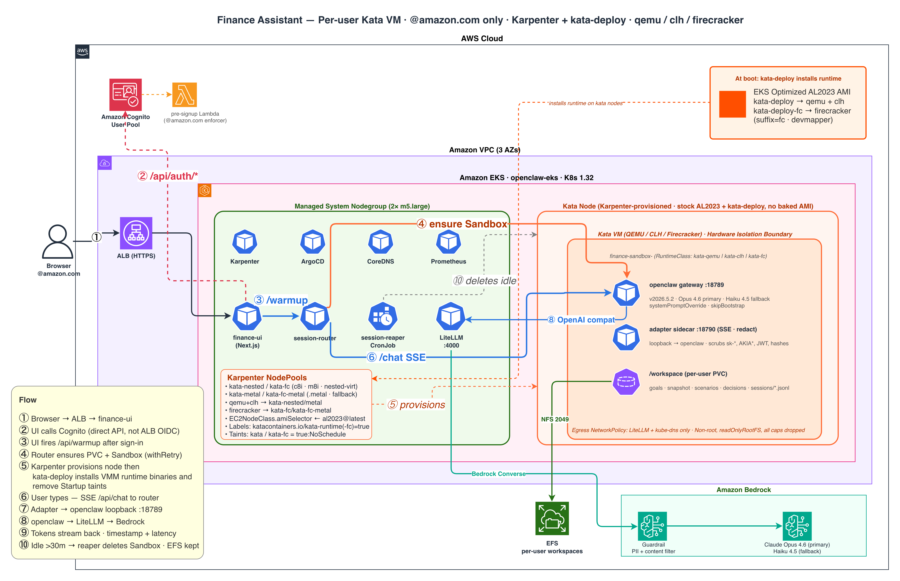

# Personal Financial Assistant on OpenClaw

A read-only, privacy-first financial coach that runs inside a Kata QEMU VM on EKS. No bank, brokerage, or credential access — ever. The agent is useful precisely *because* of that constraint: it becomes a thinking partner, not a transactor.

## Architecture overview



A web browser signs in via Amazon Cognito (gated to `@amazon.com` addresses by a pre-signup Lambda). The Next.js UI (`finance-ui`) sets a short HttpOnly session cookie, then fires `/api/warmup` so a per-user Kata QEMU VM is bound in the background while the user is still deciding what to ask. A thin `session-router` pod creates one declarative `SandboxClaim` per authenticated Cognito `sub`; the agent-sandbox controller binds it to a pre-warmed sandbox from a `SandboxWarmPool` (fast) or cold-creates one (empty pool). Karpenter provisions the Kata node on demand (nested-virt `c8i`/`m8i`, or bare-metal fallback) using the stock AL2023 AMI; the kata-deploy DaemonSet installs the Kata runtime at boot. Once the sandbox is bound, `/api/chat` streams SSE through the router into the sandbox's adapter sidecar, which forwards to the `openclaw` gateway on `:18789`. The gateway calls LiteLLM, which routes to Bedrock Guardrail + Claude (Opus 4.6 primary, Haiku 4.5 fallback) via Pod Identity — no static keys. Per-user state lives in a `/workspace/users/<suffix>` subdir on a shared EFS volume (each user gets a dedicated openclaw agent rooted there, provisioned by the adapter on first use); it lives outside the claim lifecycle, so chat workspace files come back instantly on next sign-in. Idle sessions are torn down by the claim's sliding lifecycle lease (30 min), not a reaper CronJob.

Three separate fences keep non-`@amazon.com` accounts from ever provisioning a Kata pod: (1) the Cognito pre-signup Lambda rejects signups outright, (2) the UI won't fire `/api/warmup` unless the email ends with `@amazon.com`, (3) `/api/warmup` re-checks server-side before calling the router — defending against a forged or replayed session cookie.

## The design principle

Most "AI financial assistants" try to be robo-advisors — they need Plaid, Yodlee, or direct broker APIs, and their value proposition is automation. That's a crowded, high-risk space: credentials leak, OAuth scopes creep, and a misbehaving agent can drain an account.

This one inverts the model. You bring the data (paste, upload, type). The agent brings reasoning, math, scenario modeling, and durable memory of *your* goals. The blast radius if it misbehaves is a bad suggestion — never a transaction.

## What it can do

### Reasoning and explanation

- Explain any concept at the depth you ask for — Roth conversion ladders, backdoor Roth mechanics, HSA triple tax advantage, bond duration, sequence-of-returns risk, ESPP lookback math, RSU vesting tax drag, AMT triggers, wash sale rules, mega backdoor Roth via after-tax 401(k).
- Decode financial documents you paste or upload — 401(k) summary plan description, fund prospectus, benefits enrollment PDF, mortgage disclosure, loan estimate, brokerage fee schedule. Surface the fees, vesting cliffs, match formulas, and gotchas in plain language.
- Translate jargon both directions — "what does 'expense ratio' mean in practice on a $50k position over 20 years" and the inverse, "what's the technical term for the thing where I can't deduct IRA contributions above a certain income."

### Scenario math and modeling

- Compound growth projections with contribution schedules, inflation adjustment, and sequence-of-returns stress.
- Mortgage amortization, refinance break-even analysis, rent vs buy over N years with tax deduction and opportunity cost modeling.
- Debt payoff strategies — avalanche vs snowball with exact interest savings.
- Retirement drawdown modeling — 4% rule, guardrails strategy, bucket strategy, Roth conversion ladder optimization across tax brackets.
- Monte Carlo narratives — "out of 10,000 sequences, your plan survives in X% of them, fails most often because of Y."
- Tax projections — marginal vs effective, bracket management for Roth conversions, capital gains harvesting windows, NIIT thresholds.

### Decision frameworks

Not "what should I do" but "here's how to think about it":

- Emergency fund sizing based on your job stability, dependents, insurance.
- When extra dollars go to mortgage payoff vs taxable investing vs 401(k) match vs HSA.
- Traditional vs Roth contribution decision given your expected retirement bracket.
- Lump sum vs DCA for a windfall, with the historical data on why.
- Term vs whole life, why advisors push whole life, how to evaluate if it's ever right for you.
- When to fire your advisor and what an AUM fee actually costs compounded.

### Durable memory (the thing most chat tools get wrong)

A conversation about retirement planning is useless if the agent forgets your savings rate next week. This assistant maintains a per-user workspace on an encrypted PVC that survives pod restarts:

- `goals.md` — what you're working toward, horizon, priorities.
- `snapshot.md` — your self-reported financial picture (the latest version you shared). Never auto-fetched.
- `scenarios/` — saved scenario models you can revisit and tweak.
- `decisions.md` — a log of decisions you've made with the reasoning, so you can revisit *why* not just *what*.
- `questions.md` — things to think about, things to ask a CFP, things to re-evaluate at the next paycheck/quarter/year.

You can `/reset`, `/export`, or `/redact` at any time. The workspace is yours.

### Document intake

Drop a PDF or image into the UI — benefits booklet, pay stub, closing disclosure, brokerage statement (redact account numbers first). The agent extracts the structure, explains the fees, and asks clarifying questions. Documents are processed *inside* the Kata VM and never leave it except as the summarized reasoning you see in chat.

### Education on hard topics

- How an advisor's AUM fee compounds against you over 30 years.
- Why "past performance" disclaimers are load-bearing.
- The math of early retirement — why 25x expenses, when the rule breaks.
- Inheritance planning basics — step-up in basis, Roth vs traditional IRA inheritance rules post-SECURE Act.
- Insurance: term life laddering, umbrella policies, long-term care insurance's actual value proposition, disability insurance gaps.
- Estate planning primer — wills vs trusts, beneficiary designations beating wills, why naming a minor directly is a bad idea.

## What it deliberately will not do

- **No account access.** No Plaid, no OAuth into your bank, no read-only broker integration. Ever. The value you'd gain (automatic balance updates) is dwarfed by the risk of credential sprawl.
- **No specific security recommendations.** "VTSAX is a good index fund" is out. "Total US market index funds with expense ratios under 0.1% exist at Vanguard, Fidelity, and Schwab — here's how to evaluate them" is in.
- **No trade execution.** Even paper trades. The agent reasons; you act.
- **No "guaranteed returns" language.** Bedrock Guardrail denies this topic explicitly.
- **No advice framing.** The system prompt forces educational framing. Decisions are always yours, with a CFP recommendation for material ones.
- **No cross-user context leaks.** Each user gets an isolated Kata VM with its own PVC. The agent cannot know about another user's situation.

## Why this is a unique problem solver

Three things stacked together that almost nothing else offers:

1. **Hardware-isolated reasoning.** Your financial picture — even the version you typed — lives inside a Kata QEMU VM. Not a shared SaaS database. Not a multi-tenant row. A VM with its own kernel on bare-metal EC2. If the agent is compromised, it can't see other users, and it cannot exfiltrate silently because it has no outbound network except to LiteLLM.
2. **No account connection, by design.** Every other assistant's pitch assumes you want automation. This one's pitch is that you want a thinking partner who will *never* become an attack vector on your accounts.
3. **Durable, user-owned memory.** Your goals, decisions, and scenarios persist across sessions on a PVC *you* control — and `/export` gives you a markdown archive any time. You own the data; the agent rents time with it.

The combination — hardware isolation, no credentials, durable user-owned memory — is genuinely rare.

## Deployment modes

### Option A — Private web UI (recommended)

A Next.js UI fronted by an ALB with Cognito auth, deployed to the same cluster. DMs land in a chat column; scenarios render as interactive charts; document uploads go inline. See `ARCHITECTURE.md`.

### Option B — Slack (same pattern as claw-bot)

For users who already live in Slack. Same Sandbox CRD, just with the Slack plugin enabled and `allowFrom` locked to your user ID.

### Option C — Both

Slack for quick questions on mobile; the web UI for scenario modeling and document upload. They share the same PVC and system prompt.

---

## Install — web UI (Option A)

The web UI depends on the rest of the platform — EKS + Karpenter + Kata (stock AL2023 + kata-deploy) + ArgoCD + LiteLLM + Cognito. If you don't have that running yet, follow the [top-level README](../../README.md) first and come back here.

### Prerequisites

- Platform `scripts/install.sh` has completed successfully (ArgoCD syncing, LiteLLM healthy, Cognito pool created, Bedrock Guardrail applied)
- `@amazon.com` pre-signup Lambda attached to the Cognito pool:
  ```bash
  aws cognito-idp describe-user-pool --region us-west-2 \
    --user-pool-id $(terraform -chdir=terraform output -raw finance_cognito_user_pool_id) \
    --query 'UserPool.LambdaConfig.PreSignUp'
  # → should print the ARN of <cluster>-presignup
  ```
- `kubectl` context pinned to the openclaw cluster:
  ```bash
  aws eks update-kubeconfig --region us-west-2 --name openclaw-eks
  kubectl config current-context   # must end with openclaw-eks
  ```
- `podman` (or `docker`) on your workstation for the image build
- `finance_ui_host` value in `terraform/terraform.tfvars` points at a DNS name on your Route53-managed zone (external-dns will create the ALB A-record)

### Step 1 — render the deployment manifest

The manifest in `web-ui/k8s/deployment.yaml` uses `__PLACEHOLDER__` tokens for values that come from `terraform output`. The script substitutes them in place:

```bash
./scripts/render-finance-ui.sh v0.9.7
# ACCOUNT_ID, COGNITO_USER_POOL_ID, COGNITO_CLIENT_ID, COGNITO_DOMAIN_PREFIX,
# ACM_CERTIFICATE_ARN, FINANCE_UI_HOST get substituted into deployment.yaml.
```

Review the diff, commit, push. ArgoCD will sync it on the next reconcile (wave 5).

```bash
git diff examples/finance-assistant/web-ui/k8s/deployment.yaml
git add examples/finance-assistant/web-ui/k8s/deployment.yaml
git commit -m "render: finance-ui v0.9.7"
git push
```

### Step 2 — build + push the UI image

```bash
cd examples/finance-assistant/web-ui

# Login to ECR
aws ecr get-login-password --region us-west-2 \
  | podman login --username AWS --password-stdin \
    $(terraform -chdir=../../../terraform output -raw finance_ui_ecr_url | cut -d/ -f1)

# Build for the cluster's amd64 nodes
podman build --platform linux/amd64 -t finance-ui:v0.9.7 .

# Tag + push to ECR
ECR=$(terraform -chdir=../../../terraform output -raw finance_ui_ecr_url)
podman tag finance-ui:v0.9.7 $ECR:v0.9.7
podman push $ECR:v0.9.7
```

### Step 3 — watch ArgoCD roll it out

```bash
kubectl -n argocd get app finance-assistant-ui -w
# SYNC STATUS should flip to Synced, HEALTH to Healthy within ~2 min.

kubectl -n finance-assistant get pods
# finance-ui-*               Running
# finance-session-router-*   2/2 Running
```

### Step 4 — first sign-in (this is where warmup happens)

Open `https://<finance_ui_host>/` in a browser. On first load you'll see the landing page. Click **Sign in to start**, create an account with your `@amazon.com` email. The pre-signup Lambda auto-confirms (no email-code screen); the UI fires `POST /api/warmup` fire-and-forget, which provisions your per-user Kata sandbox in the background during the ~1s sign-in roundtrip.

First question latency: ~20-30s (sandbox still provisioning or warming). Subsequent questions in the same browser: ~16-20s (Claude Haiku 4.5 inference time).

### Step 5 — verify end-to-end

```bash
# 1. Cookie is set, under 1.5KB
curl -sk -D - -X POST https://<finance_ui_host>/api/auth/signin \
  -H 'Content-Type: application/json' \
  -d '{"email":"you@amazon.com","password":"..."}' -o /dev/null \
  | awk '/[Ss]et-[Cc]ookie.*fa_session/ {print "cookie line len:", length($0)}'

# 2. Non-amazon.com signup is rejected by the pre-signup Lambda
curl -sk -X POST https://<finance_ui_host>/api/auth/signup \
  -H 'Content-Type: application/json' \
  -d '{"email":"someone@gmail.com","password":"TestPass1234!Abc","name":"T"}'
#  → {"error":"Signup is restricted to @amazon.com email addresses...","code":"UserLambdaValidationException"}

# 3. Your per-user sandbox exists
kubectl -n finance-assistant get sandbox.agents.x-k8s.io -l finance.x-k8s.io/user-suffix
```

### Three @amazon.com fences

1. **Cognito pre-signup Lambda** (`terraform/lambda_presignup.tf`) — rejects signup for any other domain, auto-confirms amazon addresses
2. **Client-side check** (`web-ui/app/AuthModal.tsx`, `kickWarmup()`) — won't even fire `/api/warmup` unless the email ends with `@amazon.com`
3. **Server-side check** (`web-ui/app/api/warmup/route.ts`) — 403s the warmup request if the cookie's email domain mismatches, defending against a forged session cookie

### Day-2 operations

**Upgrade the UI image** — bump the tag in `web-ui/k8s/deployment.yaml` (or re-run `scripts/render-finance-ui.sh <new-tag>`), commit, push. ArgoCD syncs.

**Change the system prompt** — edit `system-prompt-configmap.yaml`, commit, push. For existing users to pick it up, evict their sandboxes so they re-provision with the new ConfigMap mounted:

```bash
kubectl -n finance-assistant delete sandbox.agents.x-k8s.io -l finance.x-k8s.io/user-suffix
```

EFS workspaces survive the eviction; chat history resumes on the next sign-in.

**Switch the default model** — edit `sandbox-template.yaml`; the `agents.defaults.model.primary` value inside the openclaw container command (`litellm/claude-opus-4-6` → `litellm/claude-haiku-4-5` etc.). Apply + evict bound sandboxes so the warm pool rebuilds on the new spec:

```bash
kubectl apply -f examples/finance-assistant/sandbox-template.yaml
kubectl -n finance-assistant delete sandbox.agents.x-k8s.io -l finance.x-k8s.io/user-suffix
```

**Teardown just the finance-assistant app** (leave the rest of the platform up):

```bash
kubectl -n argocd delete app finance-assistant-ui finance-assistant-sandbox --cascade=foreground
kubectl delete namespace finance-assistant   # wipes per-user sandboxes + EFS access points
```

The Cognito user pool, Bedrock Guardrail, and LiteLLM persist (terraform-managed, not Argo-managed). You can redeploy the app on top of them without re-creating accounts.

### Troubleshooting

| Symptom | Likely cause | Fix |
|---|---|---|
| Landing page 200 but clicking "Sign in to start" does nothing | UI hydration failed; React module IDs colliding | Confirm `app/chat/` directory exists and `app/app/` does NOT (the two collapse to the same webpack module). `kubectl rollout restart deploy/finance-ui` |
| Valid signin → `/chat` bounces back to `/#signin` in a loop | Cookie >4KB, Chromium silently drops it | `lib/set-session.ts` must only put `{sub, email}` in the JWT, never `id_token`/`refresh_token` |
| "⚠️ HTTP request failed" banner on first question | Router k8s API blip during provisioning | Router has `withRetry` around k8s calls (4× exp backoff). If this still happens, check `kubectl logs -n finance-assistant deploy/finance-session-router` for the underlying error and file an issue |
| Every turn takes 75–95s | openclaw image is on a pre-2026.5.0 tag | Check `kubectl -n finance-assistant get sandbox.agents.x-k8s.io -o yaml \| grep image:` — pin to `ghcr.io/openclaw/openclaw:2026.5.2` or newer. Never use `:latest` |
| Agent greets every turn with "I just came online, who am I?" | Bootstrap files seeding identity from workspace | `sandbox-template.yaml` openclaw container command must set `agents.defaults.skipBootstrap: true` in `openclaw.json` |
| Agent says "your workspace is empty" on generic questions | System prompt told it to read workspace every turn | `system-prompt-configmap.yaml` "How you work" section must say "do NOT read workspace files unless the user references their own situation" |

## Files in this directory

| File | Purpose |
|---|---|
| `README.md` | This document |
| `ARCHITECTURE.md` | Deployment sketch, UI recommendation, integration points |
| `sandbox-template.yaml` | SA + `SandboxTemplate` + `SandboxWarmPool` + shared EFS PVC (declarative provisioning) |
| `system-prompt-configmap.yaml` | Persona and behavioral constraints |
| `guardrail-overlay.tf` | Bedrock Guardrail additions for finance topics |
| `web-ui/` | Next.js UI, ALB Ingress, Cognito wiring |
| `workspace-pvc.yaml` | Namespace definition (per-user state now lives on the shared EFS volume) |

## Disclaimers

This assistant is educational. It is not a fiduciary, not a CFP, not a CPA, not a tax attorney. For any material decision — retirement plan, large tax event, estate planning, insurance — consult a licensed professional. The guardrail will remind you; so will the assistant.
